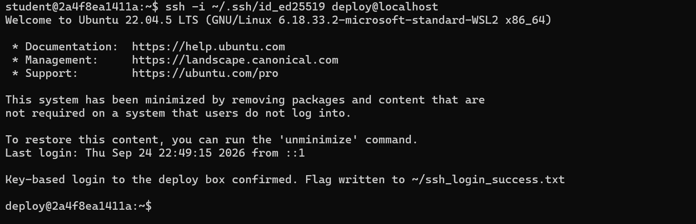
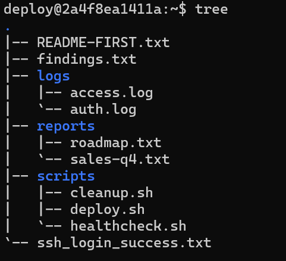
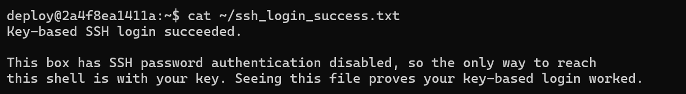

# Linux SSH Incident Response Lab

## Overview

This project documents a hands-on cybersecurity lab completed through CodePath CYB101.

The lab simulated a compromised Linux deployment server inside a Docker environment. My goal was to investigate suspicious activity, identify malicious behavior, restore the system to its expected state, and strengthen SSH access using key-based authentication.

The project gave me hands-on practice connecting Linux administration, authentication logs, shell scripting, incident response, and SSH security concepts in one environment.

## Project Highlights
- Investigated suspicious SSH authentication activity
- Identified and analyzed a malicious shell script
- Performed Linux system triage and remediation
- Configured and verified Ed25519 SSH key-based authentication
- Documented findings and proposed a security hardening recommendation

## Tools and Technologies

- Linux
- Docker
- SSH
- Bash / Shell
- `ssh-keygen`
- `curl`
- Linux file permissions
- Authentication logs

## Investigation

### SSH Log Analysis

I reviewed the system's authentication logs and identified suspicious SSH activity involving the root account.

The logs showed:

- A failed password attempt for the root account
- A successful root login shortly afterward
- Both events originating from the same external IP address

This activity suggested that an unauthorized user had successfully gained root access to the system.

### Initial SSH Login

## Malicious Script Identification

During the investigation, I identified a malicious shell script named:

`update-agent.sh`

The script repeatedly used `curl` to retrieve content from an external endpoint and immediately executed the downloaded content using `sh`.

The script also ran continuously with a 60-second delay between requests.

This behavior was consistent with malicious beaconing or command-and-control activity.

## System Triage and Remediation

After identifying the malicious activity, I restored the deployment user's home directory to its expected structure.

My remediation steps included:

- Organizing legitimate reports into a `reports/` directory
- Organizing legitimate helper scripts into a `scripts/` directory
- Correcting a mislabeled shell script filename
- Removing unnecessary cache files
- Removing the malicious script
- Preserving authentication logs for analysis
- Recording the investigation results in `findings.txt`

### Final System Tree

## SSH Key-Based Authentication

As a stretch challenge, I configured and tested SSH key-based authentication.

I:

1. Generated a new Ed25519 SSH key pair
2. Added the public key to the appropriate `authorized_keys` file
3. Applied the correct file permissions
4. Successfully authenticated to the deployment account using the new private key

This exercise helped reinforce the relationship between public and private keys and how SSH key-based authentication can provide stronger access control than password-only authentication.

### Successful Authentication With New Key

## Security Recommendation

One improvement I would make is to disable password-based SSH login for the root account and require SSH key authentication instead.

This would reduce the risk of an attacker gaining access through password guessing or stolen credentials.

## Key Takeaways

This lab helped me better understand how several cybersecurity concepts work together in practice.

I gained hands-on experience with:

- Investigating Linux authentication logs
- Recognizing suspicious login activity
- Identifying malicious shell-script behavior
- Understanding remote command execution
- Performing basic incident triage
- Using Linux file and directory commands
- Managing file permissions
- Configuring SSH key-based authentication
- Documenting indicators of compromise and remediation steps

One of my biggest takeaways was seeing how cybersecurity investigations rely heavily on analyzing system data, identifying unusual patterns, and connecting evidence across multiple sources.

## Repository Contents

- `README.md` — Project overview and investigation summary
- `findings.md` — Concise incident findings and remediation notes
- `screenshots/` — Selected screenshots showing successful authentication and system cleanup
- `.gitignore` — Prevents sensitive files such as SSH keys and environment files from being committed

## Acknowledgments

This project was completed as part of CodePath CYB101.

The original lab environment and instructional materials were created by CodePath. This repository contains my personal investigation write-up, findings, remediation process, and lessons learned.
